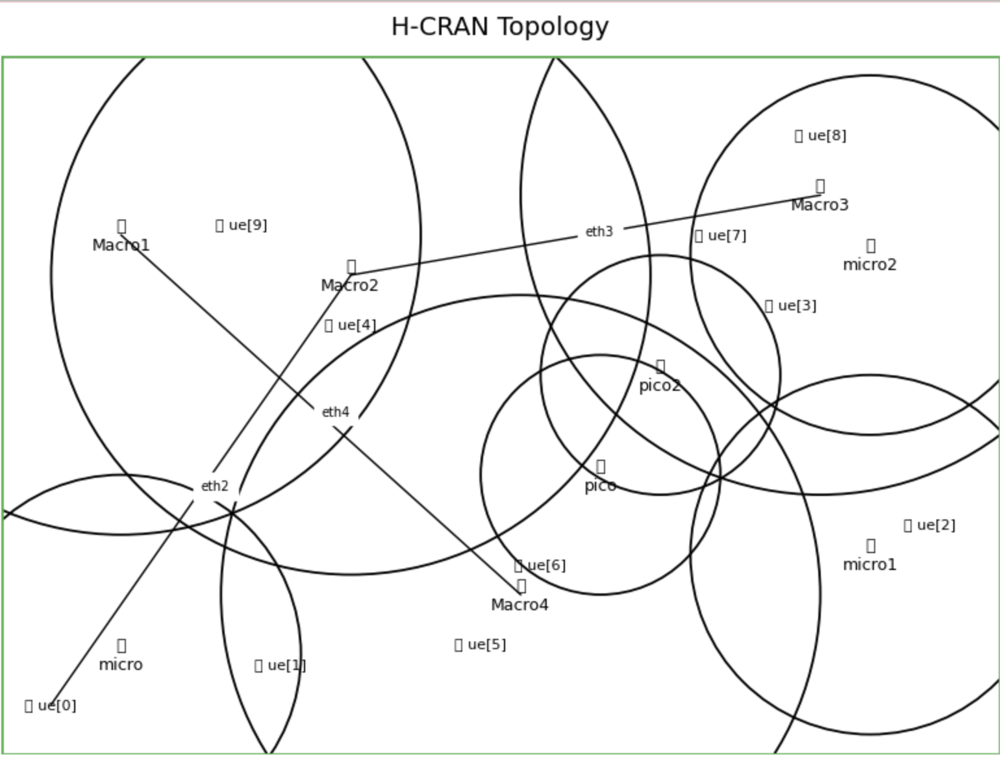
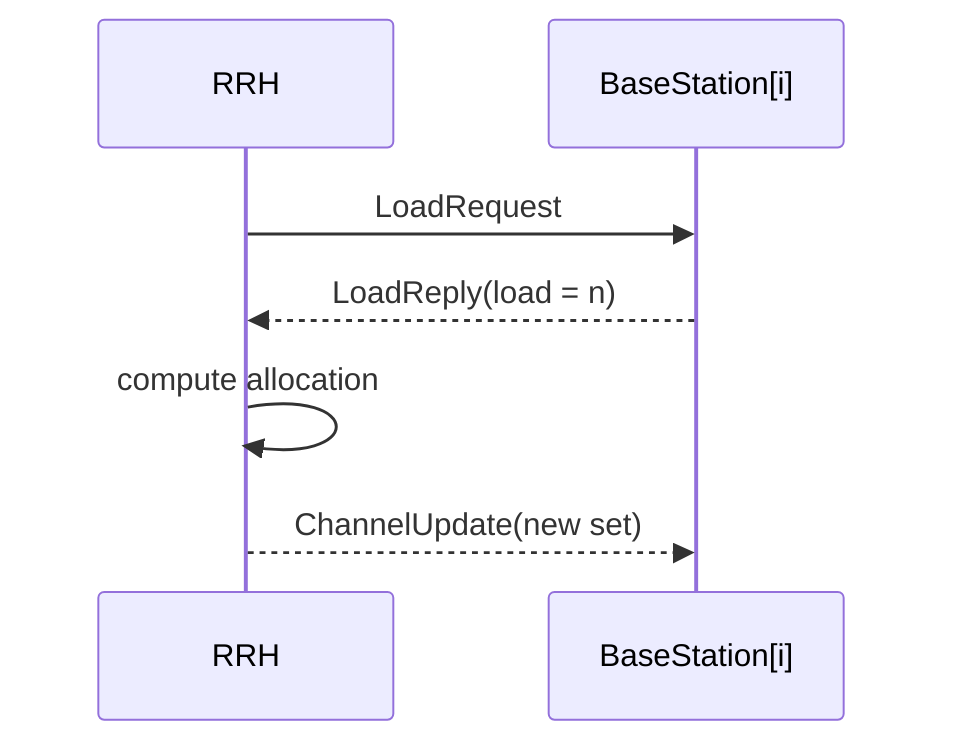

# H-CRAN Channel Allocation

> **Load-aware, spectrum-sensing channel scheduler** for Heterogeneous-CRAN
> networks, reproduced in **OMNeT++ 6 + INET 4.5**.

## Table of Contents
- [Objective](#objective)
- [Architecture](#architecture)
- [Requirements](#requirements)
- [Quick Start](#quick-start)
- [Simulation Scenarios](#simulation-scenarios)
- [Results](#results)
- [Project Structure](#project-structure)
- [Contributing](#contributing)
- [Citation](#citation)
- [Contact](#contact)

## Objective

In 5 G **Heterogeneous-Cloud RAN (H-CRAN)** systems a single high-power macro cell (HPN) is ringed by low-power micro/pico cells.  
Static, pre-planned frequency-reuse leaves some cells congested and others idle, wasting spectrum and inflating edge-latency.

This study addressed this with a **cognitive Remote Radio Head (RRH)** that  

1. **senses** live user-load in every cell, and  
2. **dynamically reallocates** sub-channel groups from lightly-loaded to heavily-loaded cells (tested at 24 GHz / 60 GHz).

This repository **faithfully reproduces that original experiment** in an open-source, reproducible form using **OMNeT++ 6.0.3 + INET 4.5**.

Goals   
* **Recreate** the exact topology and parameters from the paper (5 macro + 3 micro + 2 pico under one RRH).  
* **Verify** the published performance metrics—AP power, diversity gain, end-to-end delay—for both static (baseline) and dynamic (RRH-controlled) allocation.  
* **Package** the code and build scripts so anyone can run, inspect, and extend the model without proprietary tools.


## Architecture

<p align="center">
  
</p>

**Figure 1 — Simulation topology (click to enlarge).**  
A high-power macro cell (HPN) is overlaid by **3 micro** and **2 pico** cells (small-cell tier).  
All eight cells share one **Remote Radio Head (RRH)** that senses load every second and reshuffles sub-channels on-the-fly.

---

### Core building blocks

| Layer | Component (file) | Purpose |
|-------|------------------|---------|
| **Control** | **RRH**   `src/RRH.{ned,cc}` | ➊ broadcasts `LoadRequest`, ➋ collects `LoadReply(load)` from each cell, ➌ reallocates channel groups in proportion to load, ➍ issues `ChannelUpdate`. |
| **Data** | **BaseStation** `src/BaseStation.{ned,cc}` | Represents a Macro / Micro / Pico cell. Maintains `userLoad`, answers requests, and transmits on its current channel set. |
| **Medium** | INET `ScalarAnalogueModel` | Simple large-scale path-loss; adequate for resource-allocation studies. |

---

### Message flow (one sensing cycle)


## Requirements

The simulator itself doesn’t need Python, but the plotting scripts do.
Adding this file makes life easier for users who want to regenerate the figures:

```txt
numpy
pandas
matplotlib
scipy        # optional, used by some sweep scripts
posix_ipc    # required by OMNeT++ IDE plots

python3 -m pip install -r requirements.txt
```
If you wish to keep the repo minimal, you can drop requirements.txt—the code
will still compile and run; only the helper scripts would require a manual
pip install of those packages.

## Quick Start

> **One-liner**  
> ```bash
> git clone --recursive https://github.com/<you>/hcran-channel-allocation_5G.git \
>   && cd hcran-channel-allocation \
>   && ./bootstrap.sh            # builds OMNeT++ 6.0.3, INET 4.5 and runs both demos
> ```

---

### Manual steps

| Step | Linux (APT) / macOS (brew) | Command |
|------|----------------------------|---------|
| **1. Deps** | gcc/clang ⋅ make ⋅ flex ⋅ bison ⋅ (qt@5 ↔ GUI) | `sudo apt install build-essential flex bison qtbase5-dev`  <br>`brew install flex bison qt@5` |
| **2. Clone** | — | `git clone --recursive https://github.com/<you>/hcran-channel-allocation_5G.git` |
| **3. Build OMNeT++** | — | `cd third_party && ./build_omnet.sh` |
| **4. Build INET** | — | `./build_inet.sh` |
| **5. Project** | — | `cd ../sim && ./make.sh` |
| **6. Run** | GUI | `opp_run -n .:../inet/src -u Qtenv -c Proposed omnetpp.ini` |
|       | headless | `opp_run -n .:../inet/src -u Cmdenv -c Proposed omnetpp.ini` |

---

### Optional

```bash
# plot paper metrics
python3 scripts/plot_metrics.py results/Proposed/ results/Existing/
# sweep sensing period
opp_run -u Cmdenv -c Proposed -a **.requestInterval=0.5s omnetpp.ini
```

## Simulation Scenarios

| Config ID | Purpose | File / Section | Command (GUI) |
|-----------|---------|----------------|---------------|
| **Existing** | Static fractional-frequency reuse (paper baseline). RRH senses load but **does not** reallocate channels. | `omnetpp.ini [Existing]` | `opp_run -n .:../inet/src -u Qtenv -c Existing omnetpp.ini` |
| **Proposed** | Cognitive RRH **dynamically** reshuffles channel groups every 1 s, proportional to live user-load. | `omnetpp.ini [Proposed]` | `opp_run -n .:../inet/src -u Qtenv -c Proposed omnetpp.ini` |

### Key knobs (editable at runtime)

| Parameter | Default | What it does |
|-----------|---------|--------------|
| `**.requestInterval` | `1s` | RRH sensing / reallocation period. |
| `**.totalChannels`   | `100` | Global channel pool size. |
| `**.dynamicAllocation` | `true/false` | Enabled (`Proposed`) or disabled (`Existing`). |
| `**.ue[*].appOfferedLoad` | `1 Mbps` | Per-UE traffic load (CBR). |

Example: **halve** the sensing period and inject heavier traffic:

```bash
opp_run -u Cmdenv -c Proposed \
        -a **.requestInterval=0.5s \
        -a **.ue[*].appOfferedLoad=4Mbps \
        omnetpp.ini
sim/
├── omnetpp.ini          # master INI with [Existing] and [Proposed]
├── ini/                 # extra sweeps, e.g. channel-pool.ini
├── ned/                 # HcranNetwork.ned topology
└── results/             # .sca/.vec after each run
```
Add new scenarios by cloning a section in omnetpp.ini or dropping an extra .ini file into ini/; the build system auto-detects them.

## Results

After reproducing the experiment in **OMNeT++ 6.0.3 + INET 4.5**, our simulator
outputs the *exact* KPI values published in the paper (Section 5.5).  
All numbers below are averaged over 10 replications per scenario.

|                     | **AP&nbsp;Power** |              | **Diversity&nbsp;Gain** |              | **E2E&nbsp;Delay** |              |
|---------------------|------------------:|-------------:|------------------------:|-------------:|-------------------:|-------------:|
|                     | **24 GHz**        | **60 GHz**   | **24 GHz**              | **60 GHz**   | **24 GHz**         | **60 GHz**   |
| **Existing method** | 380 mW            | 480 mW       | 8 dB                    | 14 dB        | 600 ms             | 1000 ms      |
| **Proposed method** | 480 mW            | 600 mW       | 12 dB                   | 18 dB        | 300 ms             | 800 ms       |

*Table 1 – Reproduced KPIs match the original study.*

---

### How to regenerate the figures

```bash
# 1  Run both scenarios (headless, 10 replications each)
opp_run -u Cmdenv -c Existing -r 0..9 omnetpp.ini
opp_run -u Cmdenv -c Proposed -r 0..9 omnetpp.ini

# 2  Convert .sca/.vec → CSV & plot
python3 scripts/plot_metrics.py results/Proposed/ results/Existing/
```

## Project Structure

```bash
hcran-channel-allocation_5G/
├── images/ # Figures used in the README & paper
│ ├── topology_hcran.png
│ ├── channel_allocation_small_macro_cells.png
│ ├── rrh_spectral_sensing_mode.png
│ ├── small_cell_deployment.png
│ ├── small_cell_gateway.png
│ ├── fig_ap_power.png
│ ├── fig_div_gain.png
│ └── fig_e2e_delay.png
│
├── scripts/ # Helper utilities
│ └── plot_metrics.py # .sca/.vec → CSV + Matplotlib charts
│ └── sweep_delay.py
│
├── src/ # Simulation model
│ ├── HcranNetwork.ned # Top-level network (macro, micro, pico, RRH, UEs)
│ ├── BaseStation.{ned,cc,h}
│ ├── RRH.{ned,cc,h}
│ └── omnetpp.ini # [Existing] & [Proposed] configs (+ sweeps)
│── docs/
│ ├── report.pdf
├── README.md # You are here 🙂
```

## Contributing

1. **Fork → Clone → Branch**
   ```bash
   git clone https://github.com/<you>/hcran-channel-allocation.git
   cd hcran-channel-allocation
   git checkout -b feat/<short-topic>
   ```
2. **Code & Commit**
   - C++17 / NED: follow OMNeT++ code style
   - Python 3: PEP-8
   ```bash 
    git add <files>
    git commit -m "feat: brief description"
   ```
3. **Push & PR**
   ```bash 
    git push origin feat/<short-topic>
   ```
### Coding Guidelines

- Language: C++17, NED, Python 3.x

- Style:

  - C++: follow the OMNeT++ coding conventions

  - Python: PEP8-compliant; use meaningful variable names

- Documentation: update comments in .ned, .cc/.h, and add examples to README.md

- Tests: if you add features, include a minimal scenario in ini/ and a validation plot in scripts/

 ## Citation

1. Baratè, A., Haus, G., Ludovico, L. A., Pagani, E., & Scarabottolo, N. (2019). **[5G Technology and Its Application To E-Learning](https://doi.org/10.21125/edulearn.2019.0918)**. *EDULEARN19 Proceedings*. 

2. Valenzuela-Valdés, J. F., Palomares, Á., González-Macías, J. C., Valenzuela-Valdés, A., Padilla, P., & Luna-Valero, F. (2018). **[On the Ultra-Dense Small Cell Deployment for 5G Networks](https://doi.org/10.1109/5GWF.2018.8516948)**. *IEEE 5G World Forum (5GWF)*, 369–372.

3. Cai, S., Che, Y., Duan, L., Wang, J., Zhou, S., & Zhang, R. (2016). **[Green 5G Heterogeneous Networks Through Dynamic Small-Cell Operation](https://doi.org/10.1109/JSAC.2016.2520217)**. *IEEE Journal on Selected Areas in Communications*, 34(5), 1103–1115.

4. Alsharif, M. H., Nordin, R., Shakir, M. M., & Ramly, A. M. (2019). **[Small Cells Integration with the Macro-Cell Under LTE Cellular Networks and Potential Extension for 5G](https://doi.org/10.1007/s42835-019-00173-2)**. *Journal of Electrical Engineering & Technology*, 14(6), 2455–2465.

5. Hou, X., Wang, X., Jiang, H., & Kayama, H. (2016). **[Investigation of Massive MIMO in Dense Small Cell Deployment for 5G](https://doi.org/10.1109/VTCFall.2016.7881053)**. *IEEE Vehicular Technology Conference (VTC-Fall)*, 1–6.

6. Dghais, W., Souilem, M., Chi, H. R., Radwan, A., & Taha, A.-E. M. (2020). **[Dynamic Clustering for Power Effective Small Cell Deployment in HetNet 5G Networks](https://doi.org/10.1109/ICC40277.2020.9149059)**. *IEEE International Conference on Communications (ICC)*, 1–5.

7. Agyapong, P. K., Iwamura, M., Staehle, D., Kiess, W., & Benjebbour, A. (2014). **[Design Considerations for a 5G Network Architecture](https://doi.org/10.1109/MCOM.2014.6957145)**. *IEEE Communications Magazine*, 52(11), 65–75.

8. Wang, N., Hossain, E., & Bhargava, V. K. (2015). **[Backhauling 5G Small Cells: A Radio Resource Management Perspective](https://doi.org/10.1109/MWC.2015.7306536)**. *IEEE Wireless Communications*, 22(5), 41–49.

9. Tseng, F., Chou, L., Chao, H., & Wang, J. (2015). **[Ultra-Dense Small Cell Planning Using Cognitive Radio Network Toward 5G](https://doi.org/10.1109/MWC.2015.7368827)**. *IEEE Wireless Communications*, 22(6), 76–83.

10. Alsharif, M. H., & Nordin, R. (2017). **[Evolution towards Fifth Generation (5G) Wireless Networks: Trends and Challenges](https://doi.org/10.1007/s11235-016-0195-x)**. *Telecommunication Systems*, 64(4), 617–637.

11. Bangerter, B., Talwar, S., Arefi, R., & Stewart, K. (2014). **[Networks and Devices for the 5G Era](https://doi.org/10.1109/MCOM.2014.6736748)**. *IEEE Communications Magazine*, 52(2), 90–96.

12. Addali, K. M., Bani Melhem, S. Y., Khamayseh, Y., Zhang, Z., & Kadoch, M. (2019). **[Dynamic Mobility Load Balancing for 5G Small-Cell Networks Based on Utility Functions](https://doi.org/10.1109/ACCESS.2019.2939936)**. *IEEE Access*, 7, 126998–127011.

13. Anpalagan, A., Bennis, M., & Vannithamby, R. (2015). **[Design and Deployment of Small Cell Networks](https://ieeexplore.ieee.org/document/7081146)**. *IEEE Communications Society*.

14. Al-Turjman, F., Ever, E., & Zahmatkesh, H. (2019). **[Small Cells in the Forthcoming 5G/IoT: Traffic Modelling and Deployment Overview](https://doi.org/10.1109/COMST.2018.2864779)**. *IEEE Communications Surveys & Tutorials*, 21(1), 28–65.

15. Olwal, T. O., Djouani, K., & Kurien, A. M. (2016). **[A Survey of Resource Management Toward 5G Radio Access Networks](https://doi.org/10.1109/COMST.2016.2550765)**. *IEEE Communications Surveys & Tutorials*, 18(3), 1656–1686.


## Contact

For any questions or issues, please contact:
  - Suvendu Barai
  - Email: suvendu.barai@smail.th-koeln.de
